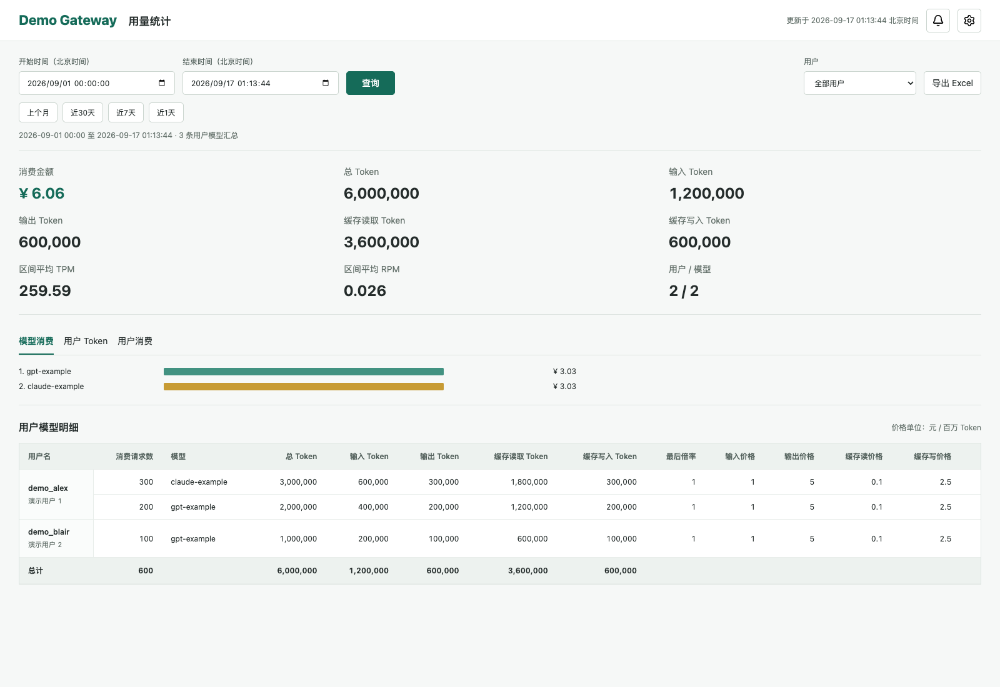

<div align="center">

# New API Statistics

**为 New API 提供用量统计、成本分析与余额报警**

[](https://github.com/ilove323/new-api-statistics/actions/workflows/ci.yml)
[](LICENSE)
[](pyproject.toml)
[](https://github.com/QuantumNous/new-api)

[快速开始](#快速开始) · [主要特性](#主要特性) · [部署要求](#部署要求) · [文档](#文档) · [帮助与贡献](#帮助与贡献)

</div>

## 项目说明

New API Statistics 是配合 [QuantumNous/new-api](https://github.com/QuantumNous/new-api)
使用的自托管统计工具，提供用户与模型用量分析、Excel 报表、预算监控及消息通知。

> [!IMPORTANT]
> **本项目必须依赖已部署的 New API，不能脱离 New API 独立使用。**
> 当前仅支持 New API 的 **PostgreSQL** 数据库，直接读取其用户、消费日志和站点配置。
> 登录使用 New API 原有的管理员账号密码。本项目不提供模型网关或独立用户系统。

应用采用 Flask + PostgreSQL，作为独立容器与 New API 部署在同一 Docker 网络，
由 Nginx 将 `/statistics/` 转发到统计应用。New API 原库用于只读查询；
预算、月度归档与报警配置保存在单独的监控库。

## 界面预览



截图中的站点、用户、模型及金额均为虚构演示数据。

## 主要特性

| 功能 | 说明 |
| --- | --- |
| 用量分析 | 查看用户、模型的输入、输出、缓存读取与缓存写入 Token；明细表支持用户、模型多选筛选及列选择 |
| 消费排名 | 模型消费、用户 Token 用量、用户消费标签页切换 |
| 时间筛选 | 精确到秒，支持上个月、近 30 天、近 7 天和近 1 天 |
| Excel 导出 | 多工作表汇总，数字单元格与 SUM 合计公式 |
| 管理员认证 | 复用 New API 管理员账号，读取原有权限和密码哈希 |
| 余额监控 | 按月、渠道完整归档费用，支持历史追溯覆盖，并动态筛选计入预算和报警的渠道 |
| 定时检查 | 每天北京时间 10:00 检查，也可通过铃铛或 API 手动触发 |
| 通知渠道 | 支持飞书企业自建应用与钉钉自定义 Webhook 机器人 |
| 报警 API | 实时余额与报警检查，使用 New API 令牌 Bearer 认证 |

Token 缓存语义取决于上游日志。部分报表数值涉及数学折算，
请先阅读[统计口径](docs/calculation.md)。应用不会修改 New API 原始日志和实际消费金额。

## 部署要求

| 依赖 | 要求 |
| --- | --- |
| New API | 必须已部署，数据库字段符合[兼容范围](docs/compatibility.md) |
| PostgreSQL | New API 原库及只读查询账号；余额监控另建独立库 |
| Docker | Docker Engine 与 Docker Compose，共用 New API 的现有网络 |
| Nginx | 推荐复用现有 HTTPS 站点，转发 `/statistics/` |
| 登录账号 | 有效的 New API 管理员账号 |

SQLite 和 MySQL 后端目前不支持。不同 New API fork 的字段、配额单位和缓存语义
可能不同，接入前应核对兼容文档。

## 快速开始

### 1. 获取项目

```bash
git clone https://github.com/ilove323/new-api-statistics.git
cd new-api-statistics
cp .env.example .env
```

### 2. 配置数据库与网络

按[部署文档](docs/deployment.md)填写 `.env` 中的 New API PostgreSQL 只读连接参数、
现有 Docker 网络名称和端口。

需要余额报警时，先按[监控库初始化文档](docs/monitoring.md)执行建库 SQL，
再配置 `MONITOR_DATABASE_URL`；启用通知渠道还需配置 `NOTIFICATION_ENCRYPTION_KEY`。

### 3. 启动服务

```bash
chmod 600 .env
docker compose up -d --build
docker compose ps
```

### 4. 配置入口

将 [nginx.conf.example](nginx.conf.example) 中的 location 加入现有 HTTPS 站点，
检查配置并重载 Nginx，然后访问：

```text
https://<你的域名>/statistics/
```

使用 **New API 管理员账号密码**登录。

没有 Nginx 时，可按[直接端口访问说明](docs/deployment.md#无-nginx-直接访问)配置宿主机端口。
镜像部署可下载 [v0.1.1 Release](https://github.com/ilove323/new-api-statistics/releases/tag/v0.1.1)
中的配置文件，设置 `IMAGE_TAG=0.1.1`，按[发版说明](docs/releasing.md)启动。

## 文档

| 主题 | 内容 |
| --- | --- |
| [部署](docs/deployment.md) | 环境变量、网络、Nginx、直接端口访问及认证 |
| [统计口径](docs/calculation.md) | 缓存包含关系、金额、倍率及数学折算 |
| [兼容范围](docs/compatibility.md) | New API 数据库字段与运行环境 |
| [余额监控](docs/monitoring.md) | 建库 SQL、额度设置、归档和报警规则 |
| [通知渠道](docs/notifications.md) | 飞书与钉钉配置及通知行为 |
| [报警 API](docs/api.md) | 认证方式、请求示例与返回值 |
| [升级与备份](docs/upgrading.md) | 数据库迁移、备份和回退 |
| [发版](docs/releasing.md) | GitHub Actions、版本标签及 GHCR 镜像 |

## 帮助与贡献

维护者与当前贡献者：[@ilove323](https://github.com/ilove323)。

- 问题反馈与功能建议：[GitHub Issues](https://github.com/ilove323/new-api-statistics/issues)
- 开发与贡献：[CONTRIBUTING.md](CONTRIBUTING.md)
- 版本变化：[CHANGELOG.md](CHANGELOG.md)
- 安全问题：[SECURITY.md](SECURITY.md)

反馈时请提供版本、复现步骤和脱敏日志，不要提交管理员密码、API Key 或客户数据。

## 致谢与许可证

感谢 [QuantumNous/new-api](https://github.com/QuantumNous/new-api)。
本项目是依赖 New API 的第三方统计工具，非 New API 官方组件。

Copyright 2026 ilove323。采用 [Apache-2.0](LICENSE)，允许商业使用。
New API 及其他依赖各自遵循其许可证。
第三方图标许可见 [NOTICE](NOTICE) 和 [Lucide 许可](src/new_api_statistics/static/LUCIDE-LICENSE)。
